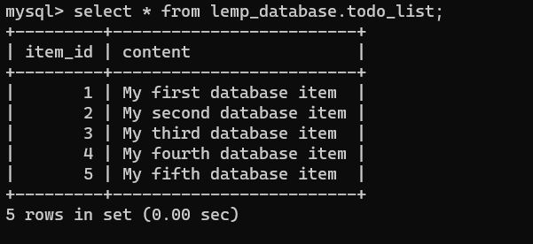

# AWS LEMP STACK IMPLEMENTATION
 ## **This project shows how to implement LAMP**(Linux-Nginx-Mysql-Php) on AWS

 ## .......................................Installing NGINX Webserver......................................
--- 
 Update a list of packages in package manager

 `sudo apt update -y`

Run Nginx package installation

 `sudo apt install nginx`

 Verify Nginx is running.

 `sudo systemctl status nginx`

 

 Verify the web server is reaachable from the localhost

```
 curl http://localhost:80

or

 curl http://127.0.0.1:80
 
```


Get IPV4 ip address by using the command  

curl http:// 169.254.169.254/latest/meta-data/public-ipv4

When you open a browser and input the public ip address outputed by the previous command you should get a welcome page from Nginx.

`http://<Public-IP-Address>:80`


## .......................INSTALLING MYSQL..............................
---
Install MYSQL packahe using apt command

`sudo apt install mysql-server`

Log into Mysql console.

`sudo mysql`


we will run a security script that comes with Mysql to change some insecure default settings, but before then we are setting root password as shown below.

`ALTER USER 'root'@'localhost' IDENTIFIED WITH mysql_native_password BY 'PassWord.1'`

Exit Mysql.

`exit`

Run the security with the command.

`sudo mysql_secure_installation`

This will ask if you want to configure the VALIDATE PASSWORD PLUGIN, After the validation is completed, login to MYSQL and input the password by adding the -p flag.

`sudo mysql -p`

After succcessful confimation of login, you can exit MYSQL

`exit`

## ......................................INSTALLING PHP........................................
---

We need to install php-fpm, which stands for “PHP fastCGI process manager”, and tell Nginx to pass PHP requests to this software for processing. Additionally, we need php-mysql, a PHP module that allows PHP to communicate with MySQL-based databases. Core PHP packages will automatically be installed as dependencies.

`sudo apt install php-fpm php-mysql -y`

## ...................................Configuring Nginx to Use PHP Processor......................................
---
We will create a folder called projectLEMP for our webserver.
Create the root web directory for your_domain in /var/www/ folder as follows:

`sudo mkdir /var/www/projectLEMP`

Next, assign ownership of the directory with the $USER environment variable, which will reference your current system user:

`sudo chown -R $USER:$USER /var/www/projectLEMP`

Open a new configuration file in Nginx’s sites-available directory

`sudo nano /etc/nginx/sites-available/projectLEMP`


After editing, save and close the file. If you’re using nano, you can do so by typing `CTRL+X` and then `y` and `ENTER` to confirm.

:ets activate the configuration by linking the config file from Nginx’s sites-enabled directory, This will tell Nginx to use the configuration next time it is reloaded:

`sudo ln -s /etc/nginx/sites-available/projectLEMP /etc/nginx/sites-enabled/`

Let's test the configuration is working.

`sudo nginx -t`


We need to disable default Nginx host that is currently configured to listen on port 80, for this run:

`sudo unlink /etc/nginx/sites-enabled/default`

Let's reload NGINX to apply these changes. 

`sudo systemctl reload nginx`

Create an index.html file in the location /var/www/projectLEMP so that we can test that your new server block works as expected:

```
sudo echo 'Hello LEMP from hostname' $(curl -s http://169.254.169.254/latest/meta-data/public-hostname) 'with public IP' $(curl -s http://169.254.169.254/latest/meta-data/public-ipv4) > /var/www/projectLEMP/index.html
```
Now ;et's try to open your website URL from the browser using IP address or DNS name:

`http://<Public-IP-Address>:80`  or  `http://<Public-DNS-Name>:80`

The LEMP stack is now fully configured. In the next step, we’ll create a PHP script to test that Nginx is in fact able to handle .php files within our newly configured website.

## ..............................TESTING PHP WITH NGINX............................
---

we can do this by creating a test PHP file in our document root. let's open a new file called info.php:

`sudo nano /var/www/projectLEMP/info.php`


we can now access this page in the web browser by visiting the domain name or public IP address set up in the Nginx configuration file, followed by /info.php:

`http://`server_domain_or_IP`/info.php`


## ......................RETRIEVING DATA FROM MYSQL DATABASE WITH PHP........................
---

We will create a database named lemp_database and a user named lemp_user.

First, connect to the MySQL console using the root account and password:

`sudo mysql -p`

Let's create a new database and user.

`mysql> CREATE DATABASE `\`lemp_database \`;


Now you can create a new user and grant him full privileges on the database you have just created.

`mysql>  CREATE USER 'lemp_user'@'%' IDENTIFIED WITH mysql_native_password BY 'Password#1';`

Now we need to give this user permission over the lemp_database database:

`mysql> GRANT ALL ON lemp_database.* TO 'lemp_user'@'%';`

This will give the lemp_user user full privileges over the   **lemp_database** database, while preventing this user from creating or modifying other databases on your server.

Let's exit the MySQL shell with:  `exit`

Now we login to our `lemp_database` with the new `lemp_user` account created.

`mysql -u lemp_user -p lemp_database`

Let's confirm we have access to `lemp_database`.

`mysql> SHOW DATABASES;`


Next, we’ll create a test table named todo_list with the following statement:

```
 CREATE TABLE lemp_database.todo_list (item_id INT AUTO_INCREMENT,content VARCHAR(255),PRIMARY KEY(item_id));
```
Let's insert a few rows of content in the test table. Ywe will repeat the next command a few times, using different VALUES:

```
INSERT INTO example_database.todo_list (content) VALUES ("My first database item");
INSERT INTO example_database.todo_list (content) VALUES ("My second important item");
```
To see the contents of our table, run the command:

`mysql> select * from lemp_database.todo_list;`



we will exit MYSQL.
`exit`

We will create a PHP script that will connect to MySQL and query the content. let's create a new PHP file in the custom web root directory.

`nano /var/www/projectLEMP/todo_list.php`

```
<?php
$user = "lemp_user";
$password = "Password#1";
$database = "lemp_database";
$table = "todo_list";

try {
  $db = new PDO("mysql:host=localhost;dbname=$database", $user, $password);
  echo "<h2>TODO</h2><ol>";
  foreach($db->query("SELECT content FROM $table") as $row) {
    echo "<li>" . $row['content'] . "</li>";
  }
  echo "</ol>";
} catch (PDOException $e) {
    print "Error!: " . $e->getMessage() . "<br/>";
    die();
}
```
Save and close Nano.
`ctrl + w` then press `y` and `Enter.

Mow lets access the todo_list.php page from our web browser

`http://<Public_domain_or_IP>/todo_list.php`


If you get an output like the picture above it shows the php environment can successfuy interaxt with the mysql database.

### ***Thank you !!!***